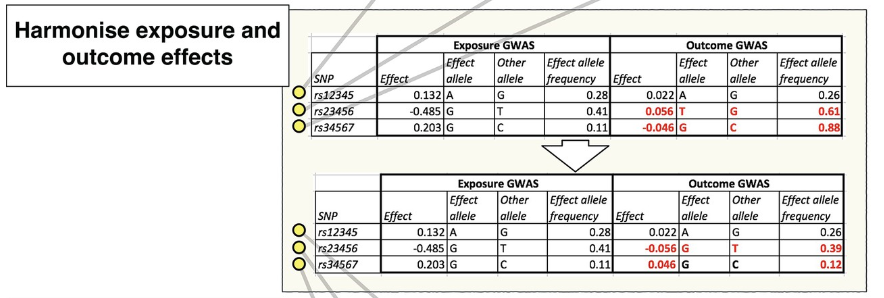
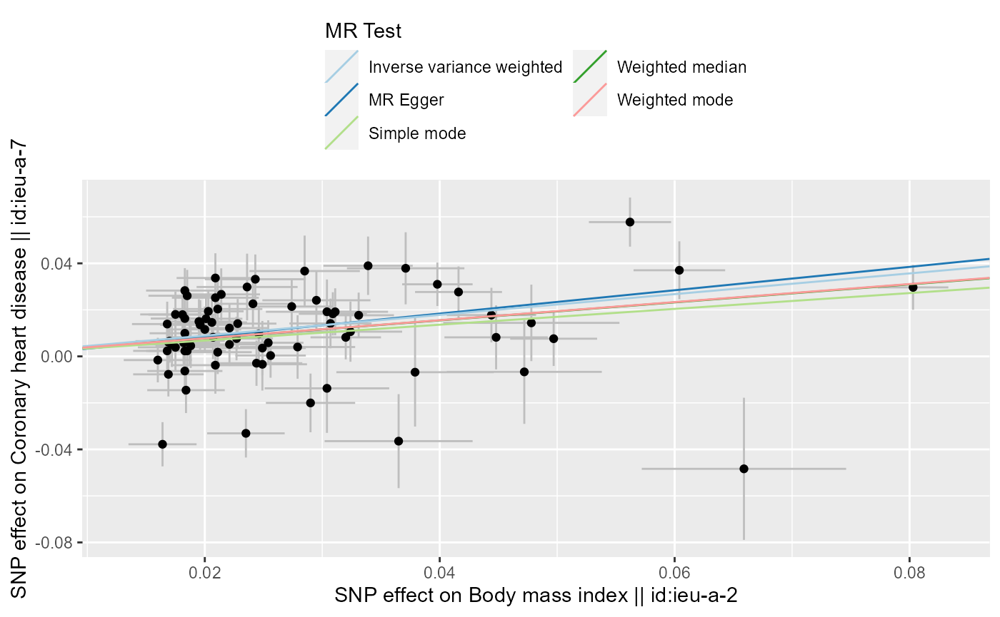
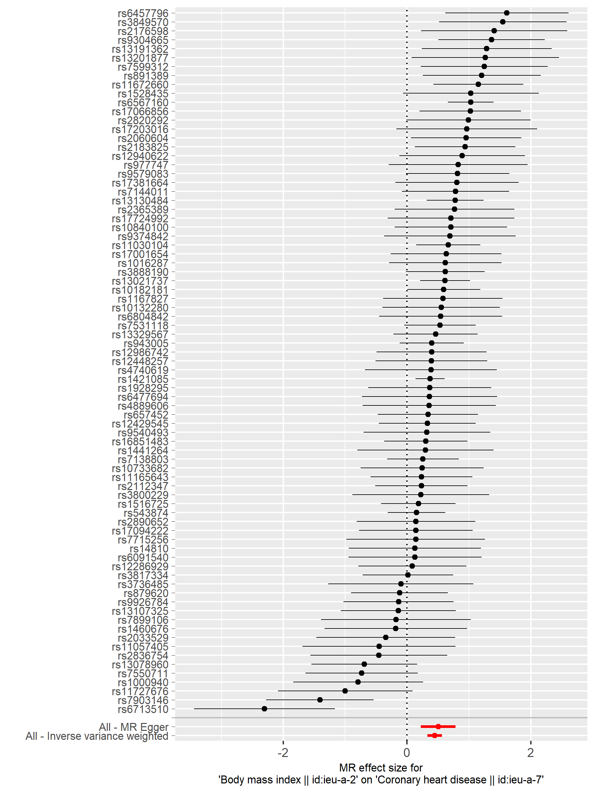

```{r setup, include=FALSE}
options(htmltools.dir.version = FALSE)
```

class: middle, center, title-slide

# Practical MR session using R
<br>

## Daniele Bottigliengo
## Institute for Biomedicine, Eurac Research, Bolzano, Italy
## July 22th, 2021

.pull-left[

<br>
<br> 


]

.pull-right[


]
---

# Outline

1. **Introduction**
  - _Two-sample MR framework_
  - _R packages for Two-sample MR_

1. **Data preparation**
  - _Summary GWAS data_
  - _Data harmonization_
  
1. **Performing MR analysis**
  - _`MendelianRandomization` and `TwoSampleMR` functions_
  - _Displaying results_
  
1. **Sensitivity analyses**
  - _Evaluating MR assumptions_
  - _Using MR robust methods_
  
1. **Case study**

---

# Introduction

<br>

- .font140[Two sample MR analysis]

<br>

- .font140[Summary instrument-exposure and instrument-outcome association results]

<br>

- .font140[Summary-level data from GWAS]

<br>

- .font140[Non-overlapping sets of individuals]


---

# R packages

.pull-left[

### [`TwoSampleMR`](https://mrcieu.github.io/TwoSampleMR/index.html)

- GWAS database

- Data harmonization

- Most commonly used MR methods

- Visualization and sensitivity analyses

- Installation from Github:

```r
install.packages("remotes")
remotes::install_github("MRCIEU/TwoSampleMR")
```

]

.pull-right[

### [`MendelianRandomization`](https://cran.r-project.org/web/packages/MendelianRandomization/index.html)

- GWAS database

- Several MR methods are implemented

- Visualization and sensitivity analyses

- Installation from CRAN:

```r
install.packages("MendelianRandomization", dependencies = TRUE)
```

]

---

# Data sources

- .font150[Retrieving summary-level GWAS data:]

  - .font120[[NHGRI-EBI GWAS Catalog](https://www.ebi.ac.uk/gwas/)]
  
  - .font120[[dbGaP CHARGE Consortium GWAS results](https://www.ncbi.nlm.nih.gov/gap/) (*study accession phs000930*)]
  
  - .font120[[Neale lab](http://www.nealelab.is/uk-biobank)]
  
  - .font120[[GeneATLAS](http://geneatlas.roslin.ed.ac.uk/)]
  
  - .font120[[FinnGen cohort](http://r2.finngen.fi/)]

  - .font120[[Phenoscanner](http://www.phenoscanner.medschl.cam.ac.uk/)] `-> MendelianRandomization`

  - .font120[[IEU GWAS database](https://gwas.mrcieu.ac.uk/)] `-> TwoSampleMR`
  
  - GWAS consortium websites, e.g. **CKDGen**, **GIANT**, **MAGIC**,
    **ENIGMA**, **ThyroidOmics**, **COVID-19 HGI**

<br>


---

# IVs selection

<br>

<br>

- .font150[Several strategies for selecting genetic instruments]

<br>


- .font150[Accounting for:]
  - .font130[weak instrument bias]
  - .font130[linkage disequilibrium (LD), i.e. correlations between instruments]
  - .font130[horizontal pleiotropy]
  
---

# IVs selection

1. .font140[Selection of genome-wide significant instruments from GWAS exposure data] $\left( p-value < 5\times10^{-8} \right)$
  - One can select functional genetic variants, i.e. genome-wide
    significant SNPs in the encoding gene
  - Check $F-statistic$ to evaluate the strength of the instrument

1. .font140[Perform LD clumping to select independent genetic instruments]
  - Typical thresholds at $r^{2} < 0.01$ and $r^{2} < 0.001$
  
1. .font140[Proxies can be used to replace exposure variants that are missing in the outcome dataset]
  - The proxy should be in high LD with the missing genetic instrument
  
1. .font140[Applying Steiger filter to remove IVs for which there might evidence of reverse causation]

---

# Data harmonization



<br>

<https://elifesciences.org/articles/34408>

---

class: middle

# MR analysis

```{r, echo = FALSE, out.width = "103%", out.height = "103%"}
flow <- DiagrammeR::grViz("digraph{
                          
  graph[layout = dot, rankdir = LR]
  
  # Define the global shape of the boxes
  node [shape = rectangle, style = filled, fillcolor = OrangeRed]
  
  # Define the nodes
  primary [label = 'Primary \n analysis']
  iv [label = 'One \n genetic instrument', style = dashed, shape = plaintext]
  ivs [label = 'Multiple \n genetic instruments', style = dashed, shape = plaintext]
  wald [label = 'Wald estimator', fillcolor = DarkOrange]
  ivw [label = 'IVW', fillcolor = DarkOrange]
  fe [label = 'IVW \n fixed-effect', shape = oval]
  re [label = 'IVW \n random-effect \n (default)', shape = oval]
  corr [label = 'IVW \n fixed-effect \n correlated variants', shape = oval, fillcolor = DarkTurquoise]
  ce [label = 'Has a causal effect \n been identified?', style = dashed, shape = plaintext]
  sens [label = 'Sensitivity analyses']
  
  
  # Define the edges
  primary -> {iv, ivs} iv -> wald ivs -> ivw ivw -> {re, fe}
  fe -> corr fe -> ce corr -> ce re -> ce ce -> sens
  

}")

flow
```

---

# MR analysis

.pull-left[



<small><small>
<https://mrcieu.github.io/TwoSampleMR/articles/perform_mr.html>
<small><small>

]

.pull-right[



]

---

# Sensitivity analyses

<br>

- .font140[Evaluation of MR assumptions]

<br>

- .font140[Check for the presence of pleiotropic effects]
  
  + .font120[Heterogeneity of Wald estimates using Q-statistic or ] $I^{2}$
  + .font120[Intercept of MR-Egger]
  
<br>

- .font140[Leave-one-out analysis to assess the reliance of MR analysis on a particular variant]

---

# Robust MR methods

- Valid causal inferences under weaker assumptions than
the standard IVW methods

- Using multiple methods that make different assumptions
about the nature of the underlying pleiotropy

- Most commonly used robust methods:
  
  + .font90[_MR-Egger_] $\rightarrow$ `TwoSampleMR` and `MendelianRandomization`
  + .font90[_Median based method_] $\rightarrow$ `TwoSampleMR` and `MendelianRandomization`
  + .font90[_Mode based method_] $\rightarrow$ `TwoSampleMR` and `MendelianRandomization`
  + .font90[_MR-PRESSO_]  $\rightarrow$ [`MR-PRESSO`](https://github.com/rondolab/MR-PRESSO) R package
  
  
- A simulation study<sup>1</sup> has shown that two recent methods have good statistical properties in a wide range of scenarios:
  + .font90[_Contamination mixture_] $\rightarrow$ implemented in `MendelianRandomization` with `mr_conmix` function
  + .font90[_MR-Mix_]  $\rightarrow$ [`MR-Mix`](https://github.com/gqi/MRMix) R package
  
  
.footnote[
.font70[

[1] Slob EAW, Burgess S. **A comparison of robust Mendelian randomization methods using summary data**. _Genetic Epidemiology_. 2020;44:313–29.

]
]
  
---

# Other approaches to sensitivity analysis

<br>

- .font140[Using different datasets]

<br>

- .font140[Positive and negative control outcomes]

<br>

- .font140[Subgroup analyses]

<br>

- .font140[Evaluate association with potentially pleiotropic variables]

---

# Case study

<br>

- .font140[**Aim**: to evaluate the causal relationship between kidney function and blood pressure (BP)]

<br>

- .font140[**Exposure**: estimated glomerular filtration rate from serum creatinine (eGFRcr)]

<br>

- .font140[**Outcome**: systolic blood pressure (SBP)]

<br>

---

# Case study


- .font140[Two sets of IVs:]

<br>

  + .font120[256 SNPs associated with eGFRcr at genome-wide threshold] $\left( p-value < 5\times10^{-8} \right)$

<br>

  + .font120[40 SNPs associated with both eGFRcr and blood urea nitrogen (BUN) at genome-wide threshold] $\left( p-value < 5\times10^{-8} \right)$ $\rightarrow$ prioritizing IVs most likely relevant for 
  kidney function

<br>

