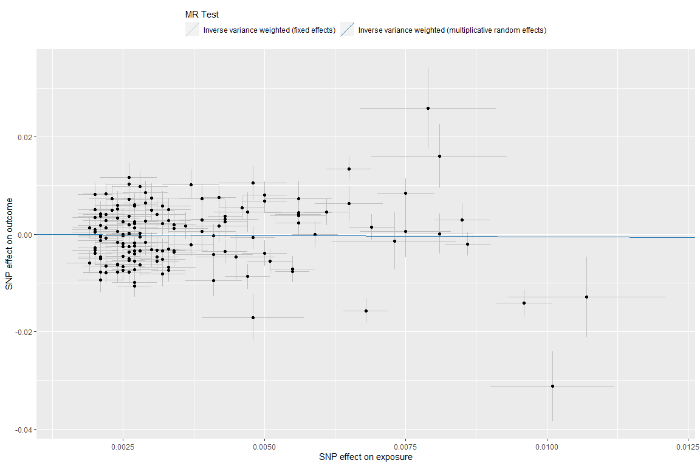
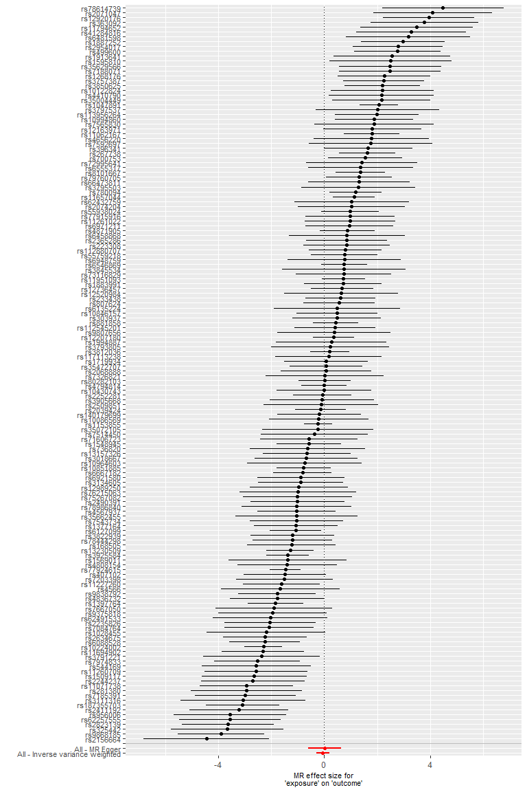
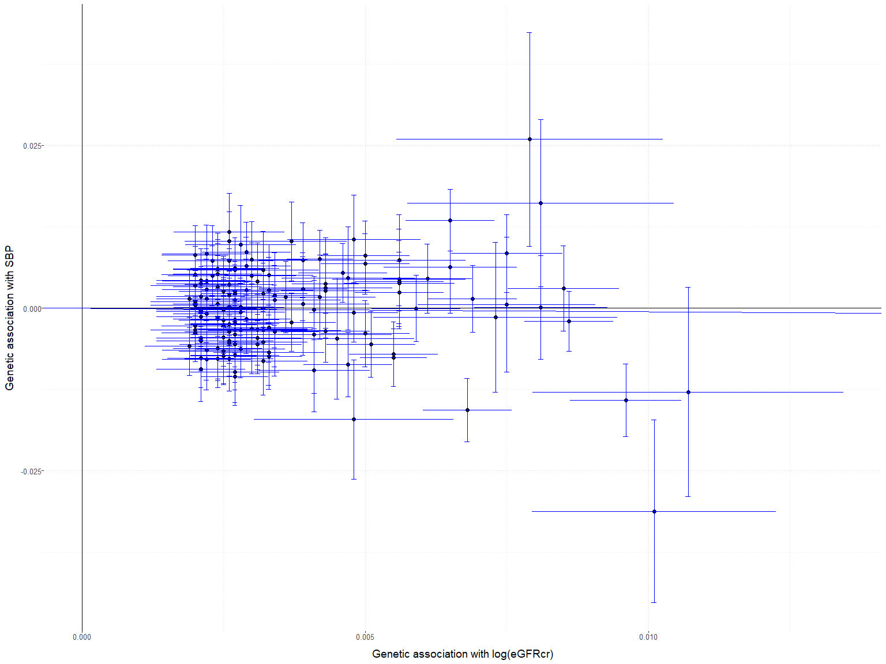
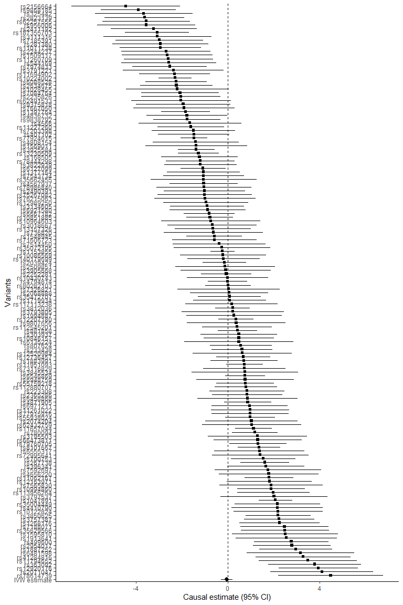
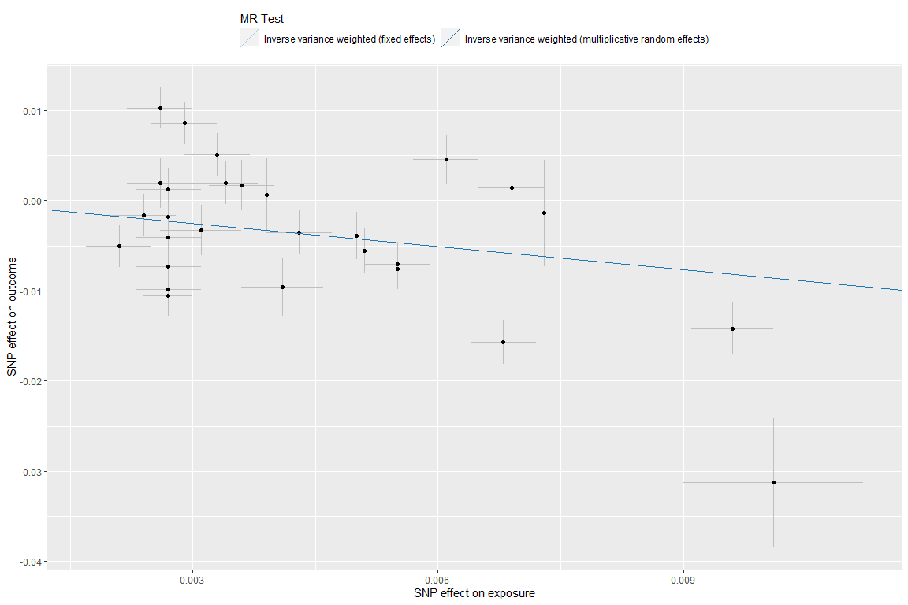
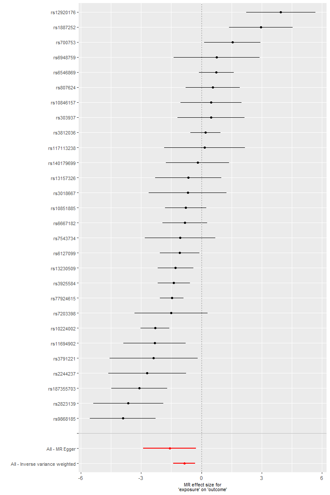
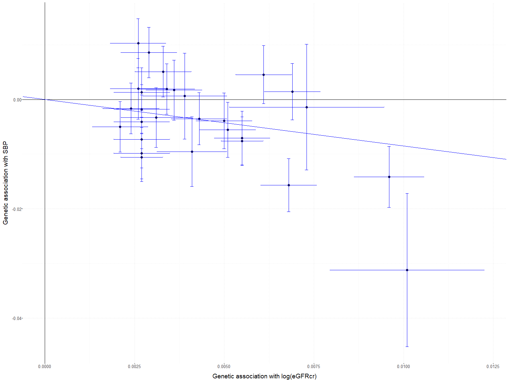
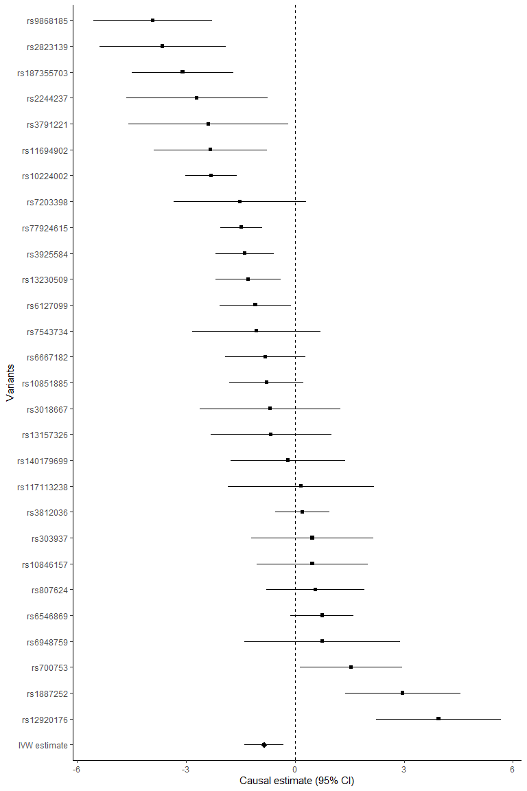

MR Kidney function on Systolic blood pressure
================

# Introduction

This document will serve as tutorial for demonstrating an MR analysis
workflow. The evaluation of causal relationship between kidney function
(KF), measured with estimated glomerular filtratio rate in serum
creatinine (eGFRcr), and systolic blood pressure (SBP) will be used as
case study. The analysis workflow is based on a recent study by Yu and
colleagues (Yu et al. 2020).

The causal effect of eGFRcr on SBP will be investigated using two
starting sets of genetic instruments selected using two distinct
rationales:

1.  The first approach includes all 256 single nucleotide polymorphism
    (SNP) associated with eGFRcr at a genome-wide significant level
    (*p* − *v**a**l**u**e* &lt; 5 × 10<sup> − 8</sup>) provided in the
    supplementary table *S*1 in Wuttke et al. (2019) (Wuttke et
    al. 2019).

2.  The second approach includes 40 of the starting 256 SNPs from genome
    wide association study (GWAS) of blood urea nitrogen (BUN). Lower
    BUN are related to higher kidney function. Hence, the SNPs that are
    most likely associated with KF rather than eGFRcr should be
    associated with BUN in the opposite direction. The 40 SNPs were
    included in the second set because showed opposite effect direction
    in BUN GWAS and satisfied the Bonferroni threshold
    (*p* − *v**a**l**u**e* &lt; 0.05/256)

<br>

The tutorial will show how to implement the following steps of MR
analysis:

1.  **Data preparation**, which involves LD clumping, data harmonization
    and Steiger filtering

2.  **MR primary analysis**, which involves running MR analysis using
    inverse-variance-weighted (IVW) fixed-effects (FE) and
    random-effects (RE) methods, displaying and interpreting results

3.  **Sensitivity analyses**, which involves detecting presence of
    horizonal pleiotropy and using robust MR methods

All the steps will be implemented using `TwoSampleMR` R package.
Moreover, the R code for implementing the MR analysis using
`MendelianRandomization` R package will also be provided.

``` r
options(width = 200)
library(TwoSampleMR)
```

    ## TwoSampleMR version 0.5.6 
    ## [>] New: Option to use non-European LD reference panels for clumping etc
    ## [>] Some studies temporarily quarantined to verify effect allele
    ## [>] See news(package='TwoSampleMR') and https://gwas.mrcieu.ac.uk for further details

``` r
library(MendelianRandomization)
```

    ## Warning in .recacheSubclasses(def@className, def, env): undefined subclass "numericVector" of class "Mnumeric"; definition not updated

    ## 
    ## Attaching package: 'MendelianRandomization'

    ## The following objects are masked from 'package:TwoSampleMR':
    ## 
    ##     mr_ivw, mr_median

<br> <br>

# Approach 1

## Data preparation

Summary-level GWAS results for eGFRcr and SBP are imported. As already
mentioned, eGFRcr data are available in supplementary material (table
*S*1) from (Wuttke et al. 2019). UK Biobank (UKB) SBP data have been
extracted from summary statistics generated from [Neal
Lab](http://www.nealelab.is/uk-biobank) (file name:
*4080\_irnt.gwas.imputed\_v3.both\_sexes.tsv.bgz*).

eGFRcr data:

``` r
# Define the path for reading eGFR data
exp_dir <- "data/eGFR_EA_index_SNPs_ST11.txt"

exposure_all_dat <- read_exposure_data(
   filename = exp_dir,
   clump = TRUE,
   sep = "\t",
   snp_col = "rsid",
   beta_col = "effect",
   se_col = "se",
   eaf_col = "freq",
   effect_allele_col = "effect_allele",
   other_allele_col = "non_effect_allele",
   pval_col = "pvalue",
   samplesize_col = "n",
   gene_col = "gene",
   min_pval = 0,
   log_pval = FALSE
)
```

    ## No phenotype name specified, defaulting to 'exposure'.

    ## API: public: http://gwas-api.mrcieu.ac.uk/

    ## Please look at vignettes for options on running this locally if you need to run many instances of this command.

    ## Clumping TvfETq, 256 variants, using EUR population reference

    ## Removing 93 of 256 variants due to LD with other variants or absence from LD reference panel

By setting `clump = TRUE` LD clumping is automatically performed using
`clump_data` function with default options, i.e. clumping window 10000
kb, *r*<sup>2</sup> &lt; 0.001, and European reference population. More
details on the function can be found by typing `?clump_data`. The other
inputs of the functions represent the names of the column for summary
statistics in the original *.txt* file.

After LD clumping, 163 SNPs where retained.

**Note: beta coefficient express the association between SNPs and eGFRcr
on the log scale.**

``` r
str(exposure_all_dat)
```

    ## 'data.frame':    163 obs. of  14 variables:
    ##  $ SNP                   : chr  "rs6667182" "rs11260709" "rs11261022" "rs78614739" ...
    ##  $ gene.exposure         : chr  "AGMAT" "RSG1" "KLHDC7A" "ZDHHC18" ...
    ##  $ effect_allele.exposure: chr  "T" "T" "A" "T" ...
    ##  $ other_allele.exposure : chr  "C" "C" "C" "C" ...
    ##  $ eaf.exposure          : num  0.32 0.68 0.36 0.17 0.15 0.61 0.64 0.2 0.7 0.87 ...
    ##  $ samplesize.exposure   : int  487087 525153 562779 567440 566619 567327 567089 529260 561828 567396 ...
    ##  $ beta.exposure         : num  -0.0043 0.0024 -0.0027 0.0026 -0.0037 -0.0021 -0.0029 0.0031 0.0031 0.0056 ...
    ##  $ se.exposure           : num  4e-04 4e-04 4e-04 5e-04 5e-04 4e-04 4e-04 5e-04 4e-04 5e-04 ...
    ##  $ pval.exposure         : num  2.2e-23 1.9e-10 3.7e-14 2.1e-08 8.9e-15 ...
    ##  $ exposure              : chr  "exposure" "exposure" "exposure" "exposure" ...
    ##  $ mr_keep.exposure      : logi  TRUE TRUE TRUE TRUE TRUE TRUE ...
    ##  $ pval_origin.exposure  : chr  "reported" "reported" "reported" "reported" ...
    ##  $ id.exposure           : chr  "TvfETq" "TvfETq" "TvfETq" "TvfETq" ...
    ##  $ data_source.exposure  : chr  "textfile" "textfile" "textfile" "textfile" ...

SBP data:

``` r
out_dir <- "data/Neale_SBP_eGFR_SNPs_res.txt"

outcome_all_dat <- read_outcome_data(
  filename = out_dir,
  snps = exposure_all_dat$SNP,  # Take only the SNPs for eGFR
  sep = "\t",
  snp_col = "rsid",
  beta_col = "beta",
  se_col = "se",
  eaf_col = "AF",
  effect_allele_col = "alt",
  other_allele_col = "ref",
  pval_col = "pval",
  samplesize_col = "n_complete_samples",
  min_pval = 0,
  log_pval = FALSE
)
```

    ## No phenotype name specified, defaulting to 'outcome'.

``` r
str(outcome_all_dat)
```

    ## 'data.frame':    163 obs. of  13 variables:
    ##  $ samplesize.outcome   : int  340159 340159 340159 340159 340159 340159 340159 340159 340159 340159 ...
    ##  $ beta.outcome         : num  -0.00461 -0.00378 0.00806 0.00353 -0.0014 ...
    ##  $ se.outcome           : num  0.00247 0.00336 0.00271 0.00243 0.00226 ...
    ##  $ pval.outcome         : num  0.06181 0.26093 0.00298 0.14545 0.53436 ...
    ##  $ SNP                  : chr  "rs407102" "rs12736457" "rs267738" "rs6667182" ...
    ##  $ other_allele.outcome : chr  "C" "C" "T" "C" ...
    ##  $ effect_allele.outcome: chr  "T" "G" "G" "T" ...
    ##  $ eaf.outcome          : num  0.706 0.129 0.221 0.314 0.498 ...
    ##  $ outcome              : chr  "outcome" "outcome" "outcome" "outcome" ...
    ##  $ mr_keep.outcome      : logi  TRUE TRUE TRUE TRUE TRUE TRUE ...
    ##  $ pval_origin.outcome  : chr  "reported" "reported" "reported" "reported" ...
    ##  $ id.outcome           : chr  "3JjJwJ" "3JjJwJ" "3JjJwJ" "3JjJwJ" ...
    ##  $ data_source.outcome  : chr  "textfile" "textfile" "textfile" "textfile" ...

Data harmonization:

``` r
harm_data <- harmonise_data(exposure_all_dat, outcome_all_dat)
```

    ## Harmonising exposure (TvfETq) and outcome (3JjJwJ)

    ## Removing the following SNPs for being palindromic with intermediate allele frequencies:
    ## rs10865189, rs154656, rs8096658

Steiger filtering:

``` r
dat_steiger <- steiger_filtering(harm_data)
```

    ## Estimating correlation for quantitative trait.

    ## This method is an approximation, and may be numerically unstable.

    ## Ideally you should estimate r directly from independent replication samples.

    ## Use get_r_from_lor for binary traits.

    ## Estimating correlation for quantitative trait.

    ## This method is an approximation, and may be numerically unstable.

    ## Ideally you should estimate r directly from independent replication samples.

    ## Use get_r_from_lor for binary traits.

``` r
table(dat_steiger$steiger_dir)
```

    ## 
    ## FALSE  TRUE 
    ##     8   155

Overall, 8 out of 163 SNPs are detected as having a direction opposite
than the one under study (SBP → eGFRcr). Thus, given the SNPs removed
after data harmonization and Steiger filtering, 152 genetic variants
were selected as instruments for the MR analysis.

Dataset for MR analysis:

``` r
# Remove genetic variants with wrong effect direction
mr_data <- harm_data[dat_steiger$steiger_dir, ]
```

Dataset input for MR analysis using `MendelianRandomization` package

``` r
dat <- mr_data[mr_data$mr_keep, ]

mr_data_input <- mr_input(
   bx = dat$beta.exposure, 
   bxse = dat$se.exposure,
   by = dat$beta.outcome,
   byse = dat$se.outcome, 
   exposure = "log(eGFRcr)", 
   outcome = "SBP", 
   snps = dat$SNP, 
   effect_allele = dat$effect_allele.exposure, 
   other_allele = dat$other_allele.exposure,
   eaf = dat$eaf.exposure
)
```

<br>

## Primary MR analysis

Once data have been prepared, MR analysis can be performed. The IVW-FE
and IVW-RE are used:

``` r
mr_primary <- mr(
   dat = mr_data,
   method_list = c("mr_ivw_fe", "mr_ivw_mre")
)
```

    ## Analysing 'TvfETq' on '3JjJwJ'

``` r
mr_primary
```

    ##   id.exposure id.outcome outcome exposure                                                    method nsnp           b         se      pval
    ## 1      TvfETq     3JjJwJ outcome exposure                 Inverse variance weighted (fixed effects)  152 -0.05578421 0.05852133 0.3404742
    ## 2      TvfETq     3JjJwJ outcome exposure Inverse variance weighted (multiplicative random effects)  152 -0.05578421 0.12888890 0.6651539

An increase in 1-unit eGFRcr on the log-scale is associated with an
average decrease SBP of 0.056 mmHg. However, the large standard errors
and p-values suggest small statistical evidence in favour of a causal
association between eGFR and SBP. Notice that standard error of IVW-RE
causal estimate is larger than IVW-FE causal estimate, suggesting
presence of heterogeneity in the single SNP causal effects.

Visual inspection of MR results using scatter plot:

``` r
mr_scatter_plot(mr_primary, mr_data)[[1]]
```

<!-- -->

Forest plot:

``` r
mr_forest_plot(mr_singlesnp(mr_data))[[1]]
```

    ## Warning: Removed 1 rows containing missing values (geom_errorbarh).

    ## Warning: Removed 1 rows containing missing values (geom_point).

<!-- -->

Using `MendelianRandomization` package:

``` r
# The package is called since mr_ivw function is contained in both
# TwoSampleMR and MendelianRandomization packages
mr_feivw_mendrand <- MendelianRandomization::mr_ivw(
   mr_data_input, 
   model = "fixed"
)

mr_reivw_mendrand <- MendelianRandomization::mr_ivw(
   mr_data_input, 
   model = "random"
)

mr_feivw_mendrand
```

    ## 
    ## Inverse-variance weighted method
    ## (variants uncorrelated, fixed-effect model)
    ## 
    ## Number of Variants : 152 
    ## 
    ## ------------------------------------------------------------------
    ##  Method Estimate Std Error  95% CI       p-value
    ##     IVW   -0.056     0.059 -0.170, 0.059   0.340
    ## ------------------------------------------------------------------
    ## Residual standard error =  2.202 
    ## Residual standard error is set to 1 in calculation of confidence interval by fixed-effect assumption.
    ## Heterogeneity test statistic (Cochran's Q) = 732.4527 on 151 degrees of freedom, (p-value = 0.0000). I^2 = 79.4%.

``` r
mr_reivw_mendrand
```

    ## 
    ## Inverse-variance weighted method
    ## (variants uncorrelated, random-effect model)
    ## 
    ## Number of Variants : 152 
    ## 
    ## ------------------------------------------------------------------
    ##  Method Estimate Std Error  95% CI       p-value
    ##     IVW   -0.056     0.129 -0.308, 0.197   0.665
    ## ------------------------------------------------------------------
    ## Residual standard error =  2.202 
    ## Heterogeneity test statistic (Cochran's Q) = 732.4527 on 151 degrees of freedom, (p-value = 0.0000). I^2 = 79.4%.

``` r
mr_plot(
   mr_data_input, line = "ivw", interactive = FALSE, labels = FALSE,
   orientate = TRUE
)
```

<!-- -->

``` r
mr_forest(
   mr_data_input,
   methods = "ivw",
   ordered = TRUE
)
```

<!-- -->

<br>

## Sensitivity analyses

In MR analysis, it is often recommend to check the presence of
pleiotropic effects, which may undermine the validity of the genetic
instruments. If so, robust MR methods are used to assess how causal
estimates change when MR assumptions are relaxed.

Q-statistic is used to check the presence of heterogeneity in the single
genetic instrument estimates, which might suggest presence of
pleiotropy:

``` r
mr_heterogeneity(mr_data, method_list = "mr_ivw")
```

    ##   id.exposure id.outcome outcome exposure                    method        Q Q_df      Q_pval
    ## 1      TvfETq     3JjJwJ outcome exposure Inverse variance weighted 732.4527  151 3.90218e-77

High Q-statistic and low p-value suggest strong heterogeneity in the
single estimates. The heteogeneity was also confirmed by visual
inspection of scatter and forest plots.

MR-Egger intercept test can be a useful indicator if MR results are
affected by horizontal pleiotropy:

``` r
mr_pleiotropy_test(mr_data)
```

    ##   id.exposure id.outcome outcome exposure egger_intercept          se      pval
    ## 1      TvfETq     3JjJwJ outcome exposure   -0.0002623365 0.001132301 0.8170989

The high p-value suggests that horizontal pleiotropy should not be an
issue.

Three robust MR methods are used: MR-Egger, weighted median and weighted
mode:

``` r
mr_robust <- mr(
   dat = mr_data,
   method_list = c(
      "mr_egger_regression", "mr_weighted_mode", "mr_weighted_median"
   )
)
```

    ## Analysing 'TvfETq' on '3JjJwJ'

``` r
mr_robust
```

    ##   id.exposure id.outcome outcome exposure          method nsnp          b        se      pval
    ## 1      TvfETq     3JjJwJ outcome exposure        MR Egger  152 0.01077749 0.3150482 0.9727560
    ## 2      TvfETq     3JjJwJ outcome exposure   Weighted mode  152 0.39859345 0.2494628 0.1121765
    ## 3      TvfETq     3JjJwJ outcome exposure Weighted median  152 0.01870815 0.1175691 0.8735706

All robust methods suggest that higher eGFRcr levels are associated with
increased SBP, even though there is no statistical evidence to support a
causal effect of eGFRcr on SBP.

Sensitivity analyses using `MendelianRandomization` R package

``` r
# Q-statistic and I^2
mr_feivw_mendrand
```

    ## 
    ## Inverse-variance weighted method
    ## (variants uncorrelated, fixed-effect model)
    ## 
    ## Number of Variants : 152 
    ## 
    ## ------------------------------------------------------------------
    ##  Method Estimate Std Error  95% CI       p-value
    ##     IVW   -0.056     0.059 -0.170, 0.059   0.340
    ## ------------------------------------------------------------------
    ## Residual standard error =  2.202 
    ## Residual standard error is set to 1 in calculation of confidence interval by fixed-effect assumption.
    ## Heterogeneity test statistic (Cochran's Q) = 732.4527 on 151 degrees of freedom, (p-value = 0.0000). I^2 = 79.4%.

``` r
mr_egger_mendrand <- MendelianRandomization::mr_egger(mr_data_input)

# Look at the intercept for pleiotropy and MR-Egger for causal estimate
mr_egger_mendrand
```

    ## 
    ## MR-Egger method
    ## (variants uncorrelated, random-effect model)
    ## 
    ## Number of Variants =  152 
    ## 
    ## ------------------------------------------------------------------
    ##       Method Estimate Std Error  95% CI       p-value
    ##     MR-Egger    0.011     0.315 -0.607, 0.628   0.973
    ##  (intercept)    0.000     0.001 -0.002, 0.002   0.817
    ## ------------------------------------------------------------------
    ## Residual Standard Error :  2.209 
    ## Heterogeneity test statistic = 732.1907 on 150 degrees of freedom, (p-value = 0.0000)
    ## I^2_GX statistic: 90.5%

``` r
# Weighted mode
mr_mode_mendrand <- MendelianRandomization::mr_mbe(mr_data_input)

mr_mode_mendrand
```

    ## 
    ## Mode-based method of Hartwig et al
    ## (weighted, delta standard errors [not assuming NOME], bandwidth factor = 1)
    ## 
    ## Number of Variants : 152 
    ## ------------------------------------------------------------------
    ##  Method Estimate Std Error  95% CI       p-value
    ##     MBE    0.399     0.260 -0.111, 0.909   0.126
    ## ------------------------------------------------------------------

``` r
# Weighted median
mr_median_mendrand <- MendelianRandomization::mr_median(mr_data_input)

mr_median_mendrand
```

    ## 
    ##  Weighted median method 
    ## 
    ## Number of Variants : 152 
    ## ------------------------------------------------------------------
    ##                  Method Estimate Std Error  95% CI       p-value
    ##  Weighted median method    0.016     0.124 -0.226, 0.258   0.898
    ## ------------------------------------------------------------------

<br>

<br>

# Approach 2

## Data preparation

The second set of genetic variants was carefully selected to identify
SNPs that are most likely associated with kidney function and not just
eGFRcr.

eGFRcr data:

``` r
# Define the path for reading eGFR data
exp_dir <- "data/eGFR_EA_index_SNPs_ST11_BUN_filtered.txt"

exposure_bun_dat <- read_exposure_data(
   filename = exp_dir,
   clump = TRUE,
   sep = "\t",
   snp_col = "rsid",
   beta_col = "effect",
   se_col = "se",
   eaf_col = "freq",
   effect_allele_col = "effect_allele",
   other_allele_col = "non_effect_allele",
   pval_col = "pvalue",
   samplesize_col = "n",
   gene_col = "gene",
   min_pval = 0,
   log_pval = FALSE
)
```

    ## No phenotype name specified, defaulting to 'exposure'.

    ## Please look at vignettes for options on running this locally if you need to run many instances of this command.

    ## Clumping 6rTidd, 40 variants, using EUR population reference

    ## Removing 4 of 40 variants due to LD with other variants or absence from LD reference panel

After LD clumping, 36 SNPs where retained.

**Note: beta coefficient express the association between SNPs and eGFRcr
on the log scale.**

``` r
str(exposure_bun_dat)
```

    ## 'data.frame':    36 obs. of  14 variables:
    ##  $ SNP                   : chr  "rs6667182" "rs1887252" "rs7543734" "rs3791221" ...
    ##  $ gene.exposure         : chr  "AGMAT" "LINC01362" "BCAR3" "SH3YL1" ...
    ##  $ effect_allele.exposure: chr  "T" "C" "C" "A" ...
    ##  $ other_allele.exposure : chr  "C" "G" "G" "G" ...
    ##  $ eaf.exposure          : num  0.32 0.64 0.2 0.65 0.34 0.22 0.95 0.14 0.97 0.34 ...
    ##  $ samplesize.exposure   : int  487087 567089 529260 559185 558234 567325 496409 566391 522107 525659 ...
    ##  $ beta.exposure         : num  -0.0043 -0.0029 0.0031 0.0021 0.0034 0.0061 0.0073 0.0041 0.0101 0.0024 ...
    ##  $ se.exposure           : num  0.0004 0.0004 0.0005 0.0004 0.0004 0.0004 0.0011 0.0005 0.0011 0.0004 ...
    ##  $ pval.exposure         : num  2.2e-23 7.4e-16 9.6e-11 3.0e-09 1.5e-20 ...
    ##  $ exposure              : chr  "exposure" "exposure" "exposure" "exposure" ...
    ##  $ mr_keep.exposure      : logi  TRUE TRUE TRUE TRUE TRUE TRUE ...
    ##  $ pval_origin.exposure  : chr  "reported" "reported" "reported" "reported" ...
    ##  $ id.exposure           : chr  "6rTidd" "6rTidd" "6rTidd" "6rTidd" ...
    ##  $ data_source.exposure  : chr  "textfile" "textfile" "textfile" "textfile" ...

Data harmonization:

``` r
harm_data <- harmonise_data(exposure_bun_dat, outcome_all_dat)
```

    ## Harmonising exposure (6rTidd) and outcome (3JjJwJ)

    ## Removing the following SNPs for being palindromic with intermediate allele frequencies:
    ## rs8096658

Steiger filtering:

``` r
dat_steiger <- steiger_filtering(harm_data)
```

    ## Estimating correlation for quantitative trait.

    ## This method is an approximation, and may be numerically unstable.

    ## Ideally you should estimate r directly from independent replication samples.

    ## Use get_r_from_lor for binary traits.

    ## Estimating correlation for quantitative trait.

    ## This method is an approximation, and may be numerically unstable.

    ## Ideally you should estimate r directly from independent replication samples.

    ## Use get_r_from_lor for binary traits.

``` r
table(dat_steiger$steiger_dir)
```

    ## 
    ## FALSE  TRUE 
    ##     2    29

Overall, 2 out of 31 SNPs are detected as having a direction opposite
than the one under study SBP (→) eGFRcr. Thus, given the SNPs removed
after data harmonization and Steiger filtering, 28 genetic variants were
selected as instruments for the MR analysis.

Dataset for MR analysis:

``` r
# Remove genetic variants with wrong effect direction
mr_data <- harm_data[dat_steiger$steiger_dir, ]
```

Dataset input for MR analysis using `MendelianRandomization` package

``` r
dat <- mr_data[mr_data$mr_keep, ]

mr_data_input <- mr_input(
   bx = dat$beta.exposure, 
   bxse = dat$se.exposure,
   by = dat$beta.outcome,
   byse = dat$se.outcome, 
   exposure = "log(eGFRcr)", 
   outcome = "SBP", 
   snps = dat$SNP, 
   effect_allele = dat$effect_allele.exposure, 
   other_allele = dat$other_allele.exposure,
   eaf = dat$eaf.exposure
)
```

<br>

## Primary MR analysis

Primary MR analysis:

``` r
mr_primary <- mr(
   dat = mr_data,
   method_list = c("mr_ivw_fe", "mr_ivw_mre")
)
```

    ## Analysing '6rTidd' on '3JjJwJ'

``` r
mr_primary
```

    ##   id.exposure id.outcome outcome exposure                                                    method nsnp          b        se         pval
    ## 1      6rTidd     3JjJwJ outcome exposure                 Inverse variance weighted (fixed effects)   28 -0.8497417 0.1129158 5.254195e-14
    ## 2      6rTidd     3JjJwJ outcome exposure Inverse variance weighted (multiplicative random effects)   28 -0.8497417 0.2775172 2.199060e-03

An increase in 1-unit eGFRcr on the log-scale is associated with an
average decrease in SBP of 0.85 mmHg. The variability of the estimates
suggest strong statistical evidence in support of causal relationships
between the phenotypes. As also observed in the first approach, the
standard error of the IVW-RE estimate are doubled than IVW-FE,
suggesting heterogeneity.

Visual inspection of MR results using scatter plot:

``` r
mr_scatter_plot(mr_primary, mr_data)[[1]]
```

<!-- -->

Forest plot:

``` r
mr_forest_plot(mr_singlesnp(mr_data))[[1]]
```

    ## Warning: Removed 1 rows containing missing values (geom_errorbarh).

    ## Warning: Removed 1 rows containing missing values (geom_point).

<!-- -->

Using `MendelianRandomization` package:

``` r
# The package is called since mr_ivw function is contained in both
# TwoSampleMR and MendelianRandomization packages
mr_feivw_mendrand <- MendelianRandomization::mr_ivw(
   mr_data_input, 
   model = "fixed"
)

mr_reivw_mendrand <- MendelianRandomization::mr_ivw(
   mr_data_input, 
   model = "random"
)

mr_feivw_mendrand
```

    ## 
    ## Inverse-variance weighted method
    ## (variants uncorrelated, fixed-effect model)
    ## 
    ## Number of Variants : 28 
    ## 
    ## ------------------------------------------------------------------
    ##  Method Estimate Std Error  95% CI        p-value
    ##     IVW   -0.850     0.113 -1.071, -0.628   0.000
    ## ------------------------------------------------------------------
    ## Residual standard error =  2.458 
    ## Residual standard error is set to 1 in calculation of confidence interval by fixed-effect assumption.
    ## Heterogeneity test statistic (Cochran's Q) = 163.0925 on 27 degrees of freedom, (p-value = 0.0000). I^2 = 83.4%.

``` r
mr_reivw_mendrand
```

    ## 
    ## Inverse-variance weighted method
    ## (variants uncorrelated, random-effect model)
    ## 
    ## Number of Variants : 28 
    ## 
    ## ------------------------------------------------------------------
    ##  Method Estimate Std Error  95% CI        p-value
    ##     IVW   -0.850     0.278 -1.394, -0.306   0.002
    ## ------------------------------------------------------------------
    ## Residual standard error =  2.458 
    ## Heterogeneity test statistic (Cochran's Q) = 163.0925 on 27 degrees of freedom, (p-value = 0.0000). I^2 = 83.4%.

``` r
mr_plot(
   mr_data_input, line = "ivw", interactive = FALSE, labels = FALSE,
   orientate = TRUE
)
```

<!-- -->

``` r
mr_forest(
   mr_data_input,
   methods = "ivw",
   ordered = TRUE
)
```

<!-- -->

<br>

## Sensitivity analyses

Q-statistic:

``` r
mr_heterogeneity(mr_data, method_list = "mr_ivw")
```

    ##   id.exposure id.outcome outcome exposure                    method        Q Q_df       Q_pval
    ## 1      6rTidd     3JjJwJ outcome exposure Inverse variance weighted 163.0925   27 2.067749e-21

The high Q-statistic suggests heterogeneity, probably driven by the
three genetic instrumets with a strong positive association (see the
forest plot)

MR-Egger intercept test:

``` r
mr_pleiotropy_test(mr_data)
```

    ##   id.exposure id.outcome outcome exposure egger_intercept          se      pval
    ## 1      6rTidd     3JjJwJ outcome exposure     0.003485713 0.002939797 0.2464649

The p-value suggests that horizontal pleiotropy should not be an issue.

Robust MR methods:

``` r
mr_robust <- mr(
   dat = mr_data,
   method_list = c(
      "mr_egger_regression", "mr_weighted_mode", "mr_weighted_median"
   )
)
```

    ## Analysing '6rTidd' on '3JjJwJ'

``` r
mr_robust
```

    ##   id.exposure id.outcome outcome exposure          method nsnp         b        se         pval
    ## 1      6rTidd     3JjJwJ outcome exposure        MR Egger   28 -1.578370 0.6734262 2.700784e-02
    ## 2      6rTidd     3JjJwJ outcome exposure   Weighted mode   28 -1.180584 0.2713250 1.738261e-04
    ## 3      6rTidd     3JjJwJ outcome exposure Weighted median   28 -1.108810 0.2050620 6.402080e-08

All robust methods suggest a strong statistical association between the
phenotypes, with increased level of eGFRcr associated with lower SBP
values.

Sensitivity analyses using `MendelianRandomization` R package

``` r
# Q-statistic and I^2
mr_feivw_mendrand
```

    ## 
    ## Inverse-variance weighted method
    ## (variants uncorrelated, fixed-effect model)
    ## 
    ## Number of Variants : 28 
    ## 
    ## ------------------------------------------------------------------
    ##  Method Estimate Std Error  95% CI        p-value
    ##     IVW   -0.850     0.113 -1.071, -0.628   0.000
    ## ------------------------------------------------------------------
    ## Residual standard error =  2.458 
    ## Residual standard error is set to 1 in calculation of confidence interval by fixed-effect assumption.
    ## Heterogeneity test statistic (Cochran's Q) = 163.0925 on 27 degrees of freedom, (p-value = 0.0000). I^2 = 83.4%.

``` r
mr_egger_mendrand <- MendelianRandomization::mr_egger(mr_data_input)

# Look at the intercept for pleiotropy and Estimate for causal estimate
mr_egger_mendrand
```

    ## 
    ## MR-Egger method
    ## (variants uncorrelated, random-effect model)
    ## 
    ## Number of Variants =  28 
    ## 
    ## ------------------------------------------------------------------
    ##       Method Estimate Std Error  95% CI        p-value
    ##     MR-Egger   -1.578     0.673 -2.898, -0.258   0.019
    ##  (intercept)    0.003     0.003 -0.002,  0.009   0.236
    ## ------------------------------------------------------------------
    ## Residual Standard Error :  2.439 
    ## Heterogeneity test statistic = 154.7261 on 26 degrees of freedom, (p-value = 0.0000)
    ## I^2_GX statistic: 93.9%

``` r
# Weighted mode
mr_mode_mendrand <- MendelianRandomization::mr_mbe(mr_data_input)

mr_mode_mendrand
```

    ## 
    ## Mode-based method of Hartwig et al
    ## (weighted, delta standard errors [not assuming NOME], bandwidth factor = 1)
    ## 
    ## Number of Variants : 28 
    ## ------------------------------------------------------------------
    ##  Method Estimate Std Error  95% CI        p-value
    ##     MBE   -1.181     0.275 -1.720, -0.641   0.000
    ## ------------------------------------------------------------------

``` r
# Weighted median
mr_median_mendrand <- MendelianRandomization::mr_median(mr_data_input)

mr_median_mendrand
```

    ## 
    ##  Weighted median method 
    ## 
    ## Number of Variants : 28 
    ## ------------------------------------------------------------------
    ##                  Method Estimate Std Error  95% CI        p-value
    ##  Weighted median method   -1.162     0.210 -1.573, -0.751   0.000
    ## ------------------------------------------------------------------

<br>

<br>

# Final remarks

In this tutorial a pipeline for MR analysis has been introduced. Indeed,
the steps that involve the selection of genetic instruments and data
preparation are crucial to ensure reliable causal estimates. As
demonstrated in the case study, a careful selection of genetic
instruments consistently associated with both eGFRcr and BUN revealed a
strong causal effect of eGFRcr and SBP, whereas a more liberal strategy
did not identify any causal relationship. Moreover, sensitivity analyses
and the use of robust methods are important to evaluate the sensitivity
of the results. Using the second set of SNPs as instruments, both IVW
and robust methods causal estimates were in support of strong causal
effect of eGFRcr on SBP, suggesting that the findings are reliable.

<br>

<br>

## References

<div id="refs" class="references csl-bib-body hanging-indent">

<div id="ref-wuttke_catalog_2019" class="csl-entry">

Wuttke, Matthias, Yong Li, Man Li, Karsten B. Sieber, Mary F. Feitosa,
Mathias Gorski, Adrienne Tin, et al. 2019. “A Catalog of Genetic Loci
Associated with Kidney Function from Analyses of a Million Individuals.”
*Nature Genetics* 51 (6): 957–72.
<https://doi.org/10.1038/s41588-019-0407-x>.

</div>

<div id="ref-yu_bidirectional_2020" class="csl-entry">

Yu, Zhi, Josef Coresh, Guanghao Qi, Morgan Grams, Eric Boerwinkle,
Harold Snieder, Alexander Teumer, et al. 2020. “A Bidirectional
Mendelian Randomization Study Supports Causal Effects of Kidney Function
on Blood Pressure.” *Kidney International* 98 (3): 708–16.
<https://doi.org/10.1016/j.kint.2020.04.044>.

</div>

</div>
